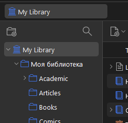
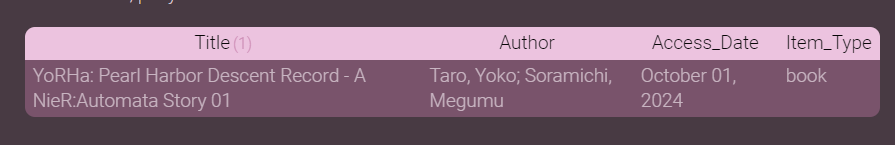

// TODO
- [ ] English

# Постановка задачи
## Цель

Отображать логи просмотренно-прочитаного (которые ведуться в Zotero) в приложении для заметок Obsidian.
## Мотивация

Я люблю отображать и фильтровать свои логи медиа в Обсидиане. И вспомнить что там было за год/месяц/тд. приятно, и рекомендовать то, что понравилось, так удобно. (Я тэгаю в  Zotero по системе "1/5" - "5/5", так что могу легко найти лучшее. Колонка в экспорте Manual_Tags.)
## Проблемы

- Насколько я знаю, dataview не читает чистую SQLite db, в которой дату хранит Zotero, ему нужен эскпорт CSV.

- В Zotero есть система коллекций. Она меня очень радует когда я её использую, но может перестать радовать при эскопрте, так-как в какой коллекции обьект находился она не сохраняет. Еще при экспорте прямо из коллекций не уходит рекурсивно в самый низ, только на один уровень, нужно убедиться что экспортируеться именно библиотека, на изображении "My Library" в самом верху иерархии.



- Кстате, Zotero db не то чтобы прям страшная, но достаточно комплексная чтобы я предпочел делать этот кульбит вместо двух SQL запросов. Если воспроизвести SQL стандартного эскпорта, то можно наверное это слегка сократить. Но там все равно есть питом который необходим чтобы dataview не ругалсь. К слову-
- У `dataview` есть ограничения: колонки без пробелов, и фильтровать по дате он сможет только если они все одинаковые. (Access Date у меня лично отличаеться, потому что когда она экспортирована автоматически, там есть дата + время, а когда я заношу её руками, то времени понятно нет.)
  
  Тобеж вот это разнообразие
  
```
	2024-11-06 13:07:34
	2024-11-06
	2024-10-31 08:30:00
```
Должно превратиться в

```
	2024-11-06
	2024-11-06
	2024-10-31
```


# Решение
## Инструменты
Главные пациенты
- **Obsidian.md**
- **Zotero**

А также
- SQLite браузер -- использован **SQLiteStudio**
- Python enviroment -- по случаю лени, использован **google.colab**.
- вьюер csv файлов как табличек и как plain text
	- **LibreOffice Calc**
	- **Notepad**

---
Также написание кода ускорил **ChatGPT**.

Хотя главная звезда тут -- правильно приложеный **SQL**.

У меня был python проэкт, абсолютно чудовищный по-сравнению с тем что здесь, который просто работал с прямыми экспортами колонок и пытался вот это все сделать в шаге 0 сделать в питоне. Ну, какое-то время он мне прослужил, но так намного лучше, конечно, слава ==**SQL-рекурсии**==.
## STEP 0: EXPORT

Для наполеоновского плана понадобиться 2 файла.

- Во первых, экспортировать именно библиотеку из самой Zotero, как я описал выше.
- Во вторых, экспортировать коллекции в формате csv из Зотеро. Как?

Скопировать текущий файл библиотеки zotero.sqlite и открыть его в любом браузере, позволяющем исполнять SQL query.

Далее, испольнить query. Она экстракнет все коллекции для каждой itemKey, то есть конкретно отношение коллекций к логам.
```
WITH RECURSIVE CollectionHierarchy AS (
    -- Base case: start with collections that directly contain the item
    SELECT
        ci.itemID,
        c.collectionID,
        c.collectionName,
        c.parentCollectionID
    FROM
        collectionItems ci
    JOIN
        collections c ON ci.collectionID = c.collectionID

    UNION ALL

    -- Recursive case: find parent collections by following the parentCollectionID hierarchy
    SELECT
        ch.itemID,
        parent.collectionID,
        parent.collectionName,
        parent.parentCollectionID
    FROM
        CollectionHierarchy ch
    JOIN
        collections parent ON ch.parentCollectionID = parent.collectionID
)

-- Select the final result
SELECT
    i.itemID,
    i.key AS itemKey,
    GROUP_CONCAT(DISTINCT ch.collectionName) AS collectionPath
FROM
    items i
JOIN
    CollectionHierarchy ch ON i.itemID = ch.itemID
GROUP BY
    i.itemID, i.key
ORDER BY
    i.itemID;
```

Результаты скопировать, сохранить в csv.

## step 0.5
`! Колонку itemKey в коллекциях переименовать в Key !`

Так как по этой колонке будет происходить склеивание. Ну или можно в библиотечном экспорте Key переименовать в itemKey, главное чтобы они были одинаковые, и по ним можно было обьеденить.

## step 0.9

Оба файла загрузить туда, где будет происходить Питон. У меня это google.colab.

Там три куска кода, которые должны спаять, сделать заголовки безпробельными для обсидиана, и нормализировать даты, тоже для обсидиана.

Параметры считывания csv надо очень аккуратно подобрать, если что-то вдруг поменяеться, иначе все плывет, что ожидаемо. На сегодняшний день и на указанные способы получения обоих файлов -- подбор read_csv правильный.

Лайфхак: если что-то идет не очень по-плану, кинуть первый элемент и хедеры в Gen ИИ, заставить его подобрать под это правильные параметры.


## step1: спаивание файлов

Решает главную проблему, спаивая файлы с коллекциями и всем остальным.

```
import pandas as pd

# Load file 1 with explicit delimiter and quote character
item_data_df = pd.read_csv('LibraryFull.csv', delimiter=',', quotechar='"', skipinitialspace=True)

# Load file 2 similarly, as it also uses commas and quotes for fields with commas
collection_paths_df = pd.read_csv('query_results.csv', delimiter=',', quotechar='"', skipinitialspace=True)

# Merge the data on 'Key' in file 1 and 'Key' in file 2 to associate item data with collection paths
merged_df = item_data_df.merge(collection_paths_df[['Key', 'collectionPath']], on='Key', how='left')

# Save the merged DataFrame to a new CSV file
merged_df.to_csv('itemData_with_collections.csv', index=False, quotechar='"')

print("Merged CSV saved as 'itemData_with_collections.csv'")

```

## step2: make title dataview readable, whitespaces need to go -> _ underscore

Убирает пробел из заголовков колонок.

```
import pandas as pd

# Load the CSV file
df = pd.read_csv('itemData_with_collections.csv')

# Remove whitespace from headers by replacing with underscores
df.columns = df.columns.str.replace(' ', '_')

# Save the modified DataFrame back to a CSV
df.to_csv('itemData_with_collections_modified.csv', index=False)

print("CSV headers modified to replace whitespace with underscores. Saved as 'itemData_with_collections_modified.csv'")

```

## step3: normalize the Access_Date

Униформнирует Access_Date чтобы по ней можно было сравнивать в dataview. 

```
import pandas as pd

# Load the CSV file
df = pd.read_csv('itemData_with_collections_modified.csv')

# Function to manually normalize the date format
def normalize_date(date):
    # Ensure the date is treated as a string
    date = str(date)
    
    # Split the string by space and take the first part (the date part)
    date_parts = date.split(' ')
    
    # Return the date (YYYY-MM-DD) part
    return date_parts[0]

# Apply the function to the 'Access_Date' column
df['Access_Date'] = df['Access_Date'].apply(normalize_date)

# Save the modified DataFrame back to a CSV
df.to_csv('itemData_with_collections_normalized.csv', index=False)

print("Access dates have been normalized to YYYY-MM-DD. Saved as 'itemData_with_collections_normalized.csv'")

```

# Dataview

Собственно, результат. Обработанный файл сохраняем куда-нибудь в хранилище, главное знать куда, и можно к нему обращаться.

## пример: лог книг за Октябрь 2024
```dataview
TABLE WITHOUT ID Title, Author, Access_Date, Item_Type
FROM csv("091_CSVs/ZoteroLibrary.csv")
WHERE Access_Date < date(2024-11-01) AND Access_Date >= date(2024-10-01)
AND contains(collectionPath, "Books")
```



## пример: избранное за Лето 2024

```dataview
TABLE WITHOUT ID Title, Author, Access_Date, Item_Type
FROM csv("091_CSVs/ZoteroLibrary.csv")
WHERE Access_Date < date(2024-09-01) AND Access_Date >= date(2024-06-01)
AND contains(Manual_Tags, "5/5")
```


